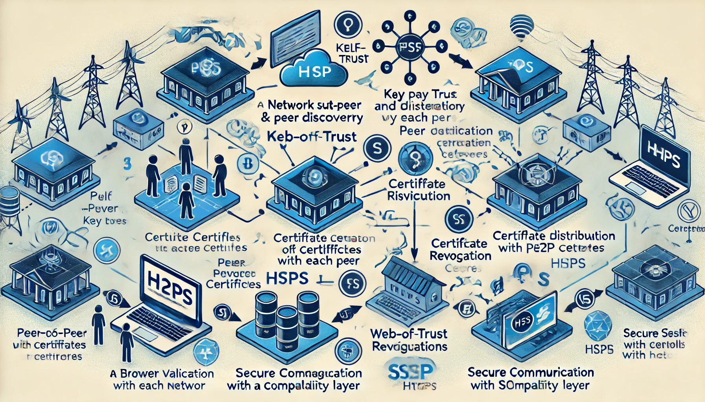

# Fauthority

Built in the open. A C++, p2p distributed cert authority.



## To build
> Just run __build.sh__

#### Detailed:

First, run 

````
cppship build
````

Currently, you will run into an error regarding Openssl. Fix the ./build/CMakeLists.txt file by:
````
- target_link_libraries(fuckauthority_deps INTERFACE openssl::openssl)
+ target_link_libraries(fuckauthority_deps INTERFACE OpenSSL::SSL OpenSSL:Crypto)
````

Then, run

````
cd ./build && cmake ./
cmake --build ./
````

These commands are added to build.sh as in the README.md
